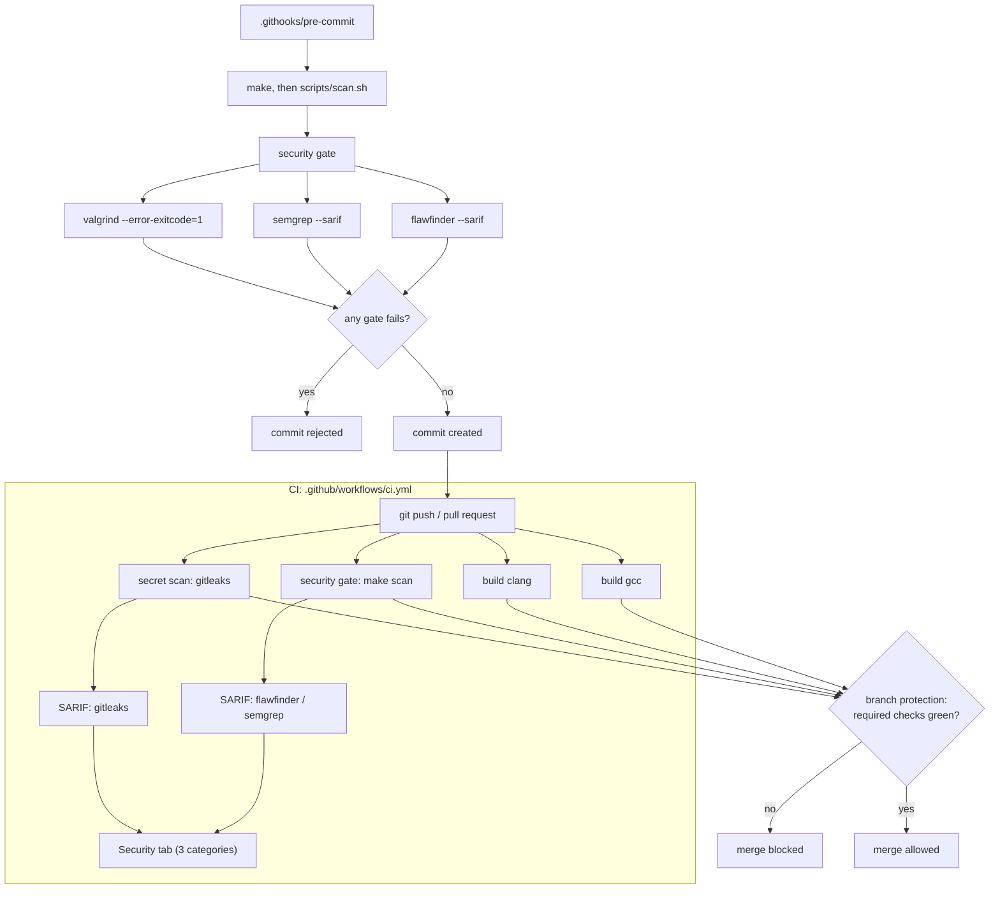

# c-secure-build

[](https://github.com/Arnaud1404/c-secure-build/actions/workflows/ci.yml)

A POSIX shell in C with deliberate bugs planted in it, wrapped in a pipeline that finds them and blocks commits until they are fixed.

The shell itself is not the point. The point is the gate around it, and the fact that you get to watch it flip: `make scan` exits 1 at the `v1-vulnerable` tag and exits 0 on `main`.

## Pipeline at a glance



Jump to: [the target](#the-vulnerable-target) · [the gate](#the-multi-engine-sarif-gate) · [CI](#the-ci-pipeline) · [quick start](#quick-start)

## The vulnerable target

`src/vuln_shell.c` is a small REPL that reads a line, splits it on whitespace, forks, and calls `execvp`. Roughly ninety lines. The `v1-vulnerable` tag freezes it in a state the gate refuses: a `strcpy` of the input line into a 32-byte global (CWE-120/787), and a `history` builtin that passes its argument straight to `printf` as the format (CWE-134). Both are at `error` severity for Flawfinder and Semgrep, and both are caught by Valgrind and AddressSanitizer too — the write-up is in [`docs/security-report-v1-vulnerable.md`](docs/security-report-v1-vulnerable.md).

This is not a secure shell implementation, and it is not trying to be one. The defects are there so the analysis engines have something to find, and so the before/after is a real diff rather than a claim.

### Why the vulnerable state is a tag and not a branch

A branch would be a second head to maintain: every change to files the two states share — CI, the Makefile, the rule pack — would have to land twice, and one accidental merge from the vulnerable side would replant the bug in `main`. A tag is frozen instead, and nothing about it ever needs rebasing or merging. Checking the tag out gives you that moment's own gate with it, which is historically true; the dataset generator overlays today's gate onto yesterday's code, so the before/after is always "current gate, old code." The annotated tag is published, and published tags do not get rewritten.

## The multi-engine SARIF gate

Four engines, two static and two dynamic:

| Engine | Kind | What it does here |
|---|---|---|
| **Flawfinder** | Lexical | Matches dangerous POSIX API names against a fixed list |
| **Semgrep** | Syntactic | 49 vendored rules from [0xdea/semgrep-rules](https://github.com/0xdea/semgrep-rules) (MIT) |
| **Valgrind** | Dynamic | Leak and error detection at runtime |
| **AddressSanitizer** | Dynamic | Instrumented builds, on by default |

Both static engines emit SARIF themselves, so no wrapper translates one format into another.

Both static engines run twice: unfiltered first, writing the SARIF report, then at the tool's own error threshold, and that second exit code is part of what decides whether the commit is blocked. Valgrind runs once — it has no report to keep, only a verdict — and its exit code is part of the same decision. Splitting the static pair means the report keeps every low-severity finding whether or not anything blocks. `make scan` is the entry point; reports land in `.security/*.sarif` and `.security/valgrind.log`.

`scripts/optional/cvss_triage.py` scores SARIF findings against a hand-built CVSS v3.1 table sourced from MITRE's CWE pages and the FIRST spec. It works, and it is not wired into `make scan`. Filling that table took about two dozen judgment calls I was able to defend but not prove, which is the wrong shape of work for a gate that has to answer pass or fail. It stays out of the repo, since "evaluated CVSS contextualisation" is a true thing to say and "shipped a risk-scoring pipeline" is not.

### The delta: `v1-vulnerable` → `main`

`record_history()` `strcpy`s the raw input line into a 32-byte global, and `show_history()` hands the `history` builtin's argument straight to `printf` as the format string. Both survive `-Wall -Wextra -Werror -pedantic -Wformat-security` on gcc and clang — `-Wformat-security` only fires on a non-literal format with no arguments, and GCC can't see the length of a `const char*` parameter at compile time — so the compiler hands both to the scanners instead of catching them first.

| Engine | Rule | Line | Level | Verdict |
|---|---|---|---|---|
| Flawfinder | `FF1001` `strcpy` [MS-banned] | 16 | **error** | strcpy overflow |
| Semgrep | `raptor-insecure-api-strcpy-strcat` | 16 | **error** | strcpy overflow |
| Flawfinder | `FF1016` printf format string | 21 | **error** | format string |
| Semgrep | `raptor-format-string-bugs` | 21 | **error** | format string |

**14 findings (Flawfinder 6, Semgrep 8), four at `error`. Flawfinder and Semgrep both block, and so do Valgrind and AddressSanitizer.** Full defect writeup, including why Valgrind blocks through its `_FORTIFY_SOURCE` replacement of `strcpy` rather than through Memcheck, and why AddressSanitizer never gets a chance to report because glibc's fortify check aborts first: [`docs/security-report-v1-vulnerable.md`](docs/security-report-v1-vulnerable.md).

At `main`, neither function exists. **8 findings (Flawfinder 3, Semgrep 5), none at `error`, `make scan` exits 0.** The two surviving rows are not bugs: Flawfinder flags `strlen` and any non-literal `printf` format without checking whether the surrounding code is correct — `getline` guarantees NUL termination, so `strlen` is safe on it — and Semgrep's five are four `interesting-api-calls` audit hits (`strtok_r`, `fork`, `execvp`) plus one false positive on `free(input_buffer)`, `raptor-mismatched-memory-management`, because `getline` is not in the rule's list of tracked allocators. Written up in `.semgrep/rules/NOTICE.md`.

`explicit_bzero(input_buffer, buffer_size)` sits in `main()`, wiping the `getline` buffer before `free()`. It was there before the remediation and it stayed, because it is justified on its own: that buffer holds whatever was typed at the prompt, which in a shell includes anything passed as a command argument. It takes `getline`'s `n`, the allocated size, rather than `strlen`, since `strlen` stops at the first null and would leave the rest of the buffer intact.

## The CI pipeline

The hook and CI run the same gates. The difference is that `git commit --no-verify` skips a hook, and nothing skips a required status check.

| Job | What it does |
|---|---|
| `build (gcc)` / `build (clang)` | Hardened build under both compilers |
| `security gate` | `make scan`, then one SARIF upload per engine |
| `secret scan` | `gitleaks` over the full history, uploaded as its own category |

Three categories reach the Security tab: `flawfinder`, `semgrep`, `gitleaks`. They stay separate. I did write a SARIF merger for this, then deleted it in Phase 7 after measuring what it produced: one cross-tool merge across thirteen findings. Code Scanning takes multiple uploads per commit keyed on `category`, and GitHub's own CodeQL CLI docs describe merging beforehand as a backwards-compatibility path, so the categories carry the same information without the code. The merger is still in the history if anyone wants to see what it looked like.

Three things in the workflow that are easy to get wrong:

The gate's exit code is captured into a step output instead of failing its own step. Uploads run under `if: always()`, and a separate step at the end fails the job. If `make scan` failed its step directly, every upload would be skipped and a blocked build would show nothing at all in the Security tab, which recouples the report to the gate. That coupling is exactly what the two-pass split in `scripts/scan.sh` exists to avoid.

Third-party actions are pinned by commit SHA, not tag. Tags move, and whoever owns `actions/checkout@v4` repoints it at will. `gitleaks` is pinned to a version and checked against a published SHA-256 before it runs, rather than curled into a shell.

Scanner versions come from `requirements.txt`, which is also what CI installs, so a local checkout and CI cannot drift apart.

One inconsistency: `valgrind` comes from the runner's apt repository and is not pinned, unlike the scanners and gitleaks. Pinning it means either an apt pin that breaks when the runner image moves, or building from source in CI. Neither seemed worth it, but it is a gap in an otherwise pinned toolchain.

### Branch protection

A workflow file cannot require its own checks. It defines them; someone has to go turn them on. After CI has run once on `main`, require these four:

`build (gcc)`, `build (clang)`, `security gate`, `secret scan`

Through **Settings → Branches → Add branch ruleset**, or:

```bash
gh api -X PUT repos/Arnaud1404/c-secure-build/branches/main/protection \
  --input - <<'JSON'
{
  "required_status_checks": {
    "strict": true,
    "contexts": ["build (gcc)", "build (clang)", "security gate", "secret scan"]
  },
  "enforce_admins": true,
  "required_pull_request_reviews": null,
  "restrictions": null
}
JSON
```

`enforce_admins: true` is the part that matters. Without it the rule does not apply to the repo owner, and "the pipeline blocks merges" quietly means "the pipeline blocks merges for everyone except me."

## Quick start

### Prerequisites

- GCC or Clang with C17 support, GNU Make
- `flawfinder` **2.0.20 or newer** (older versions have no `--sarif`), `semgrep`, `valgrind`
- `valgrind` is a distribution package: `sudo apt install valgrind` on Debian, `sudo dnf install valgrind` on Fedora
- `gitleaks` runs in CI only, pinned and checksummed there. A local `make scan` does not need it

Both Python scanners are pinned in `requirements.txt`, which is what CI installs too. Debian and Fedora both refuse a system-wide `pip install` under PEP 668, so use a venv in the repo and run the identical command CI runs:

```bash
python3 -m venv .venv
.venv/bin/pip install -r requirements.txt
```

`scripts/scan.sh` puts `.venv/bin` on `PATH` when that directory exists, so nothing needs activating. Distribution packages will not do here: Debian 13 ships flawfinder 2.0.19, which predates `--sarif`.

### Build and scan

```bash
make                  # hardened build with ASan/UBSan
make ASAN=0 all       # without sanitizers
make VALGRIND=1       # for Valgrind

./bin/c-secure-shell  # run it

make scan             # static reports + the Valgrind gate
```

Make compares timestamps and has no way of noticing that a variable changed, so switching between those three modes needs a `make clean` first. Without it the objects still look up to date and you get back a binary built with the previous flags. `make scan` cleans and rebuilds on its own, because running Valgrind against an ASan binary does not work.

`scripts/scan.sh` exits 0 when nothing blocks, 1 when a finding does, and 2 when nothing was scanned at all — a missing scanner, an engine that failed to write a report, or a block pass that exited with something other than "findings" or "no findings". The hook and CI call the script directly to preserve that last distinction: Make reports every recipe failure as its own exit 2, which would turn a broken toolchain into what looks like a security finding. `make scan` is the convenience wrapper for running the gate by hand.

Exit 2 is the case that is easy to get wrong, and this repo got it wrong once: both report passes used to end in `|| true`, so a semgrep that crashed wrote no SARIF and the gate still printed `scan clean`. An engine that cannot run has not cleared the code, it has only failed to look at it. `scripts/collect_security_data.sh` now refuses to write a dataset if that happens, rather than shipping one silently missing an engine's report.

### The pre-commit hook

Git does not clone hooks, so install it once after cloning:

```bash
make hooks
```

That points `core.hooksPath` at `.githooks/`. The hook runs the build and `make scan`, in that order; the scan itself rebuilds under Valgrind, so the memory check lives inside the gate. It is there for fast feedback. CI is the authority, since anyone is free to pass `--no-verify`.

## Hardening flags

`-Wall -Wextra -Werror -pedantic`, `-D_FORTIFY_SOURCE=3`, `-fPIE` / `-pie`, `-fstack-protector-strong`, `-Wformat-security`, and full RELRO (`-Wl,-z,relro,-z,now`).

## Project structure

```
c-secure-build/
├── src/vuln_shell.c            # the target
├── tests/vuln_shell_commands.txt  # the payload the dynamic engines run
├── scripts/scan.sh             # static reports + the Valgrind gate; blocks on either
├── scripts/collect_security_data.sh  # rebuilds the before/after dataset
├── docs/                       # the security report
├── .semgrep/rules/             # vendored pack + NOTICE
├── .githooks/pre-commit        # installed by `make hooks`
├── .github/workflows/ci.yml    # build matrix, gate, SARIF upload, secret scan
├── Makefile                    # build, scan, hooks
└── requirements.txt            # pinned scanner versions, shared with CI
```

## Security data & release

The before/after evidence is a dataset, not a claim in this README. `scripts/collect_security_data.sh` rebuilds it for any refs (default `v1-vulnerable` and `HEAD`): raw SARIF from the two static engines, per-engine gate exit codes, Valgrind and AddressSanitizer logs, an extracted findings table, tool versions, and the `src/vuln_shell.c` patch. It refuses to write a partial dataset, so a run that finishes is one every number can be read off.

```bash
scripts/collect_security_data.sh      # v1-vulnerable vs HEAD
```

The write-up: [`docs/security-report-v1-vulnerable.md`](docs/security-report-v1-vulnerable.md) — the two defects that block on Flawfinder and Semgrep at `error`, why `-Wformat-security` and `-Wstringop-overflow` let both through, and why `_FORTIFY_SOURCE=3` preempted AddressSanitizer.

CI also runs the collector and attaches `security-data-<tag>.zip` to a GitHub release whenever a `v*` tag is pushed.

## Regulatory context

Finding vulnerabilities automatically and blocking releases on them is the kind of thing the EU Cyber Resilience Act and NIS2 expect of a development process, and this pipeline does that much. I have not mapped it against specific articles, and there is no SBOM or build provenance here, so nothing in this repo should be read as a compliance claim.

## References

- [POSIX.1-2008 Process Execution](https://pubs.opengroup.org/onlinepubs/9699919799/)
- [GCC Instrumentation Options](https://gcc.gnu.org/onlinedocs/gcc/Instrumentation-Options.html)
- [SARIF 2.1.0 specification](https://docs.oasis-open.org/sarif/sarif/v2.1.0/sarif-v2.1.0.html)

---

**Author:** Arnaud Gomes
