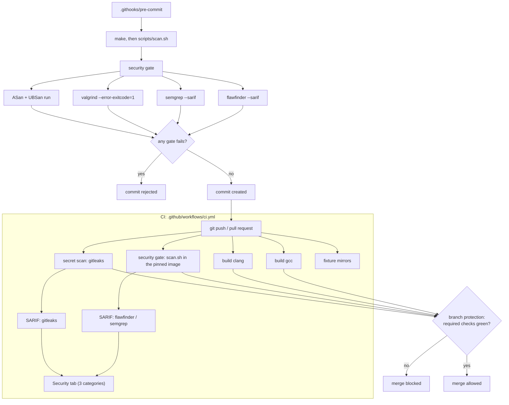

# c-secure-build

[](https://github.com/Arnaud1404/c-secure-build/actions/workflows/ci.yml)

A POSIX shell in C with four planted bugs, and a pipeline that finds them and blocks the commit until they are fixed. The shell is only there to give the scanners something to find. `make scan` exits 1 at the `v2-vulnerable` tag and 0 at `v2-patched`, which differ only in the four fixes.

## Pipeline at a glance


```mermaid
flowchart TD
    A[".githooks/pre-commit"] --> B["make, then scripts/scan.sh"]
    B --> C["security gate"]
    C --> C1["flawfinder --sarif"]
    C --> C2["semgrep --sarif"]
    C --> C3["valgrind --error-exitcode=1"]
    C --> C4["ASan + UBSan run"]
    C1 & C2 & C3 & C4 --> D{"any gate fails?"}
    D -->|yes| E["commit rejected"]
    D -->|no| F["commit created"]

    F --> G["git push / pull request"]

    subgraph CI["CI: .github/workflows/ci.yml"]
        G --> H1["build gcc"]
        G --> H2["build clang"]
        G --> H3["security gate: scan.sh in the pinned image"]
        G --> H4["secret scan: gitleaks"]
        G --> H5["fixture mirrors"]
        H3 --> S1["SARIF: flawfinder / semgrep"]
        H4 --> S2["SARIF: gitleaks"]
        S1 --> T["Security tab (3 categories)"]
        S2 --> T
    end

    H1 & H2 & H3 & H4 --> P{"branch protection:<br/>required checks green?"}
    P -->|no| M["merge blocked"]
    P -->|yes| N["merge allowed"]
```

Jump to: [quick start](#quick-start) · [the target](#the-vulnerable-target) · [the gate](#the-multi-engine-sarif-gate) · [CI](#the-ci-pipeline)

## Quick start

### Prerequisites

```bash
# Ubuntu/Debian: gcc pulls libasan8 and libubsan1 with it
sudo apt install gcc make valgrind

# RHEL/Fedora
sudo dnf install gcc make valgrind libasan libubsan
```

| Tool | What you need |
|---|---|
| GCC or Clang, GNU Make | C17 support |
| `libasan` + `libubsan` | The default build passes `-fsanitize=address,undefined`, so both runtimes must be present. `make ASAN=0 all` builds without them |
| `valgrind` | Comes from your package manager, per the block above |
| `flawfinder` | 2.0.20 or newer. Older versions have no `--sarif`, so install it from `requirements.txt` and not from your package manager |
| `semgrep` | Pinned in `requirements.txt` |
| `gitleaks` | CI only, pinned and checksummed there. A local `make scan` does not need it |

`requirements.txt` pins both Python scanners. CI installs the same file. A system-wide `pip install` is refused under PEP 668, so use a venv in the repo:

```bash
python3 -m venv .venv
.venv/bin/pip install -r requirements.txt
```

`scripts/scan.sh` puts `.venv/bin` on `PATH` when that directory exists, so nothing needs activating.

### Build and scan

```bash
make                  # hardened build with ASan/UBSan
make ASAN=0 all       # without sanitizers
make VALGRIND=1       # for Valgrind

./bin/c-secure-shell  # run it

make scan             # static reports + the ASan and Valgrind gates
```

| Command | Sanitizers | Use it for |
|---|---|---|
| `make` | ASan + UBSan | Day to day, and what the ASan pass of the gate runs |
| `make ASAN=0 all` | off | A plain hardened binary |
| `make VALGRIND=1` | off (forces `ASAN=0`) | Valgrind, which cannot run against an ASan binary |

- Switching between those three needs `make clean` first. Make compares timestamps and cannot notice that a variable changed, so stale objects give you a binary built with the previous flags.
- `make scan` cleans and rebuilds on its own for that reason.

`scripts/scan.sh` exit codes:

| Exit | Meaning |
|---|---|
| 0 | Nothing blocked |
| 1 | A finding blocked |
| 2 | Nothing was scanned: a missing scanner, an engine that wrote no report, or a block pass that exited with something other than "findings" or "no findings" |

- The hook and CI call the script directly, not through Make, to keep exit 2 distinct. Make reports every recipe failure as its own exit 2, which would turn a broken toolchain into what looks like a security finding.
- Exit 2 exists because this repo once got it wrong: both report passes ended in `|| true`, so a semgrep that crashed wrote no SARIF and the gate still printed `scan clean`.

### In the pinned container

The same gate, with the toolchain CI uses. It needs Docker or Podman. Nothing else goes on the host: no compiler, valgrind or venv.

```bash
make docker-scan                     # builds the image, then runs the gate in it
make CONTAINER=podman docker-scan    # same, with Podman
```

Like `make scan`, the Make target folds a finding and a broken toolchain alike into Make's own exit 2. The raw command keeps the script's codes:

```bash
docker build -t c-secure-build-toolchain .
docker run --rm --user "$(id -u):$(id -g)" -v "$PWD:/src" c-secure-build-toolchain
```

- The image holds the toolchain only, and the tree is mounted at `/src`, so one image scans any checkout, tags included.
- The base is `ubuntu:24.04` pinned by digest, and apt reads the Ubuntu snapshot archive at a fixed date. Every build gets the same packages: gcc 13.3, clang 18.1, valgrind 3.22.
- Rootless Podman needs `--userns=keep-id` in place of `--user`, which `make CONTAINER=podman` passes for you.

### The pre-commit hook

Git does not clone hooks, so install it once after cloning:

```bash
make hooks
```

- That points `core.hooksPath` at `.githooks/`.
- The hook runs the build, then `scripts/scan.sh`.
- It is there for fast feedback. CI is the authority, since anyone is free to pass `--no-verify`.

### Watch the gate flip

```bash
git checkout v2-vulnerable && make scan   # exits 1, blocked
git checkout v2-patched   && make scan    # exits 0, clean
```

Each tag carries its own copy of the gate, so this is the verdict that tag got at the time. CI asserts the same thing on every push. A `*-vulnerable` tag that passes the gate fails the build.

## The vulnerable target

A REPL that reads a line, splits it on whitespace, forks and calls `execvp`, plus a `history`/`recall` feature that carries the planted defects. Two versions, both readable at `HEAD`:

| Version | File | Lines | Built | Scanned |
|---|---|---|---|---|
| vulnerable | [`src/vuln_shell.c.bak`](src/vuln_shell.c.bak) | 152 | no | no |
| hardened | [`src/hardened_shell.c`](src/hardened_shell.c) | 168 | yes | yes |

The vulnerable version stays in the tree for the docs:

- It mirrors `v2-vulnerable:src/vuln_shell.c` byte for byte, so the line numbers in `docs/` resolve without checking a tag out.
- The `fixture mirrors` CI job asserts it still matches the tag.
- Neither static engine parses `.bak` as C, which keeps it out of the gate. Rename it to `.c` and `make scan` blocks.

`v2-patched` fixes all four defects ([C1 to C4](#which-engine-sees-which-defect)) in place, in 15 insertions and 9 deletions, with the feature intact. `main` has since trimmed comments. It is not meant to be a secure shell.

### Two frozen tags

| Tag | State |
|---|---|
| `v2-vulnerable` | Four defects, two of them invisible to every static engine |
| `v2-patched` | Same feature, same test input, four defects fixed, gate clean. `main` started here and is free to refactor on top |

They are tags because a branch would be a second head to maintain, with every change to shared files (CI, the Makefile, the rule pack) landing twice, and one accidental merge from it would replant the bugs in `main`. A tag never needs rebasing, and checking it out brings back the gate it had.

## The multi-engine SARIF gate

| Engine | Kind | What it does here |
|---|---|---|
| Flawfinder | Lexical | Matches dangerous POSIX API names against a fixed list |
| Semgrep | Syntactic | 49 vendored rules from [0xdea/semgrep-rules](https://github.com/0xdea/semgrep-rules) (MIT) |
| Valgrind | Dynamic | Leak and error detection at runtime |
| AddressSanitizer | Dynamic | Instrumented build run on the test input, with UBSan and LeakSanitizer; any report blocks |

Both static engines emit SARIF themselves, so nothing translates between formats. Each one runs twice:

- Pass 1, unfiltered, writes `.security/*.sarif` with every finding down to `note` level.
- Pass 2 runs at the tool's own error threshold, and its exit code is what blocks.

That way a clean gate still ships a full report. Valgrind and ASan each run once, on separate builds, and leave a log in `.security/` instead of SARIF.

### Which engine sees which defect

All four defects compile cleanly under `-Wall -Wextra -Werror -pedantic -Wformat-security` on gcc and clang, so they all reach the scanners.

| | Defect | CWE | Flawfinder | Semgrep | Valgrind | ASan |
|---|---|---|---|---|---|---|
| C1 | `strcpy` of the input line into a 32-byte global | 120/787 | error | error | not triggered | not triggered |
| C2 | `history` passes its argument to `printf` as the format | 134 | error | error | silent | silent |
| C3 | Recall ring overwrites `strdup`ed entries without freeing | 401 | silent | silent | definitely lost | LeakSanitizer |
| C4 | Occupancy flags from `malloc` where `calloc` was meant | 457 | silent | silent | conditional jump | silent, exit 0 |

- C1 and C2 block on both static engines.
- C3 and C4 are invisible to both. C3 blocks on Valgrind and ASan, C4 on Valgrind alone.
- C4 is why the pipeline runs Valgrind as well as ASan: uninitialised reads are MemorySanitizer's job, and MemorySanitizer cannot be combined with `-fsanitize=address`.
- C1 says "not triggered" because the test input never types a line long enough to overflow the buffer. If it did, glibc's hardening check would kill the process right there, before C3 and C4 happen, and one defect would hide the other three. The report measures that case separately.

### The delta: `v2-vulnerable` → `v2-patched`

| Signal | `v2-vulnerable` | `v2-patched` |
|---|---|---|
| `make scan` | 1, blocked | 0, clean |
| Flawfinder block pass | 1 | 0 |
| Semgrep block pass | 1 | 0 |
| Valgrind | 7 | 0 |
| AddressSanitizer | 1 | 0 |
| Findings, total | 23 | 23 |
| Findings at `error` | 4 | 0 |

- Every verdict flips while the total stays at 23, because the gate reads severity, not count.
- Most of the 23 are `note`-level hits on fixed-size arrays and audit-candidate API calls, none of them defects.
- The vulnerable commit needed `git commit --no-verify` to exist, while the patched one passed the same hook unforced.

Full writeup: [`docs/security-report-v2-vulnerable.md`](docs/security-report-v2-vulnerable.md).

## The CI pipeline

The hook and CI run the same gates. The difference is that `git commit --no-verify` skips a hook, and nothing skips a required status check.

| Job | What it does | In the required list below |
|---|---|---|
| `build (gcc)` / `build (clang)` | Hardened build under both compilers | yes |
| `security gate` | `scripts/scan.sh` in the pinned toolchain image, then one SARIF upload per engine | yes |
| `secret scan` | `gitleaks` over the full history, uploaded as its own category | yes |
| `fixture mirrors` | Asserts `src/vuln_shell.c.bak` still matches `v2-vulnerable` | no |

Mirror drift therefore turns the job red without blocking the merge. Add it to the list if you want the docs' line numbers guarded the same way the gate is.

Three categories reach the Security tab, and they stay separate: `flawfinder`, `semgrep`, `gitleaks`. Code Scanning accepts multiple uploads per commit keyed on `category`, and GitHub's own CodeQL CLI docs describe merging beforehand as a backwards-compatibility path, so I deleted the SARIF merger I had written for this after measuring what it produced: one cross-tool merge across thirteen findings.

- The gate step records its exit code instead of failing, so the SARIF uploads still run on a blocked build. A final step fails the job.
- Third-party actions are pinned by commit SHA, since a tag like `actions/checkout@v4` can be moved. `gitleaks` is pinned to a version and checked against its published SHA-256.
- The gate runs in the same image as `make docker-scan`, so a local run uses CI's toolchain.
- The release job is not in the image yet. The gate's valgrind is pinned, but the job that attaches `security-data-<tag>.zip` to a release still runs the collector on the runner, with valgrind from the runner's apt repository. The collector uses `git worktree`, and running it in the image means adding git and trusting a mounted checkout, which is its own change. `requirements.txt` pins semgrep and flawfinder but not their dependencies.

### Branch protection

A workflow file cannot require its own checks. After CI has run once on `main`, require `build (gcc)`, `build (clang)`, `security gate` and `secret scan` through Settings → Branches → Add branch ruleset, or:

```bash
gh api -X PUT repos/Arnaud1404/c-secure-build/branches/main/protection \
  --input - <<'JSON'
{
  "required_status_checks": {
    "strict": true,
    "contexts": ["build (gcc)", "build (clang)", "security gate", "secret scan"]
  },
  "enforce_admins": true,
  "required_pull_request_reviews": null,
  "restrictions": null
}
JSON
```

Keep `enforce_admins: true`. Without it, the rule does not apply to the repo owner.

## Hardening flags

| Flag | Why |
|---|---|
| `-Wall -Wextra -Werror -pedantic` | Every warning on, warnings are build failures, strict ISO C17 |
| `-D_FORTIFY_SOURCE=3` | Runtime bounds checks on libc calls whose sizes the compiler cannot prove |
| `-fPIE` / `-pie` | Position-independent executable, so ASLR applies to the binary itself |
| `-fstack-protector-strong` | Stack canaries on functions with local arrays or address-taken locals |
| `-Wformat-security` | Warns on a non-literal format string with no arguments |
| `-Wl,-z,relro,-z,now` | Full RELRO: the GOT is resolved at load time and mapped read-only |

`explicit_bzero(input_buffer, buffer_size)` wipes the `getline` buffer before `free()`, because in a shell that buffer holds anything typed at the prompt, including command arguments. It takes `getline`'s `n` rather than `strlen`, which would stop at the first null and leave the rest intact.

## Project structure

```
c-secure-build/
├── src/hardened_shell.c        # the target: built, scanned, gated (started as v2-patched)
├── src/vuln_shell.c.bak        # mirror of v2-vulnerable; not built, not scanned
├── tests/vuln_shell_commands.txt  # the test input the dynamic engines run
├── scripts/scan.sh             # the gate: static, ASan and Valgrind passes
├── scripts/collect_security_data.sh  # rebuilds the before/after dataset
├── docs/                       # the security reports
├── .semgrep/rules/             # vendored pack + NOTICE
├── .githooks/pre-commit        # installed by `make hooks`
├── .github/workflows/ci.yml    # build matrix, gate, SARIF upload, secret scan
├── Makefile                    # build, scan, hooks, image, docker-scan
├── Dockerfile                  # the pinned toolchain image the gate runs in
└── requirements.txt            # pinned scanner versions, shared with CI
```

## Security data & release

`scripts/collect_security_data.sh` rebuilds the before/after data for any two refs:

- Raw SARIF from both static engines
- Per-engine gate exit codes
- Valgrind and AddressSanitizer logs
- An extracted findings table and the tool versions that produced it
- The patch between the two refs

If the gate cannot run at either ref, it exits 1, and CI publishes no release.

```bash
scripts/collect_security_data.sh                            # v2-vulnerable vs HEAD
scripts/collect_security_data.sh v2-vulnerable v2-patched   # the reproducible delta
```

- Compare the two tags for a result that reproduces, since `HEAD` moves.
- CI runs the collector and attaches `security-data-<tag>.zip` to a GitHub release whenever a `v*` tag is pushed.
- [`docs/security-report-v2-vulnerable.md`](docs/security-report-v2-vulnerable.md) is the write-up. It covers the four defects, which engine sees each one, and what the fix changed.

## Regulatory context

- Finding vulnerabilities automatically and blocking releases on them is the kind of thing the EU Cyber Resilience Act and NIS2 expect of a development process, and this pipeline does that much.
- I have not mapped it against specific articles, and there is no SBOM or build provenance here, so nothing here should be read as a compliance claim.

## References

- [POSIX.1-2008 Process Execution](https://pubs.opengroup.org/onlinepubs/9699919799/)
- [GCC Instrumentation Options](https://gcc.gnu.org/onlinedocs/gcc/Instrumentation-Options.html)
- [SARIF 2.1.0 specification](https://docs.oasis-open.org/sarif/sarif/v2.1.0/sarif-v2.1.0.html)

---

**Author:** Arnaud Gomes
